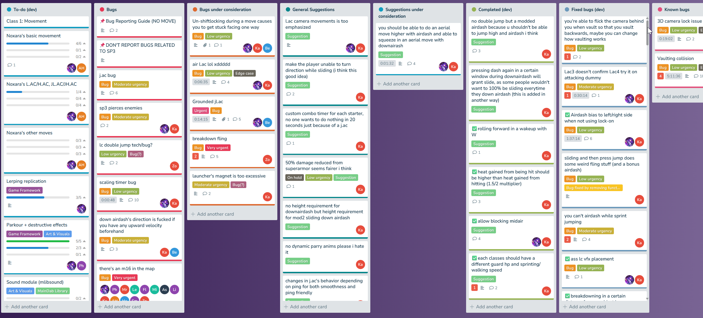

> For ROC's small audience:
> 
> This my personal project and was not made for my CV. **However, ROC shows I am capable of doing something unfamiliar and handling project management**, and I want others to know that. I do not see a reason to "gatekeep" whatever I written.

# Rise of Corruption
ROC is [my attempt](https://www.roblox.com/communities/710433451) at making a Roblox fighting game (well, 3D) from scratch. It is *not* a "battleground" game; some mechanics found in traditional fighters exist in ROC. [Black Magic II](https://www.roblox.com/games/969669348) and [Souls Combat Remastered](https://www.roblox.com/games/6540690875) inspired ROC.

The conceptual objective of ROC was to make a game easier to play than BM:II or SCR in regards to mechanics and controls, and instead focus on creating interesting classes/characters.

I worked and coordinated with other volunteers online in getting ROC to this point. The reason why this repository is marked as **archived** is because up until 18 June 2026, all the code in this project is of my own effort. (Most) animations, sound effects, and modeling are done by people I commissioned -- this has been possible as I made effort before starting ROC to [create sources of (passive) income on Roblox](https://www.roblox.com/communities/34025858/Echolyth#!/store).

Also on 18 June 2026, I have decided to accept help from other Roblox Lua scripters/contributors. While I can release assets I paid for, it is a different story releasing code not made by me, since code authorship is much harder to establish.
# History
I started the project around October 2025, and as of June 2026 it is still a work in progress. The codebase here is highly incomplete (i.e. only the core framework is done, no actual classes/characters made!), but is usable by anyone with experience.

The code for ROC was never meant to be public, but since I would like to show what I can do, here is ROC, one of the **long term** projects I want to show.

This project has nothing to do with my Computer Science bachelor's (at the time, I was in Year 1) and is purely a passion project. However, it shows I am capable of doing something unfamiliar and handling project management, both things employers are looking for.
# Why Roblox?
Aside from Roblox being familiar to me, hosting on Roblox is free, with networking made very easy. Roblox also has a rather large and still growing audience. Though Roblox is seen as entry-tier compared to Unity or Unreal, it was only pragmatic for me to choose Roblox given my available resources and experience.

Out of brutal honesty, many others at my age and experience level try make a game on Unity or Unreal, only to end up with nothing in the end. My chances making something on Roblox were much higher.
# Credits

* Thank you to all my amazing testers, in particular [Kalmrelia](https://www.roblox.com/users/1556104309) (very extensive tester) and [alsoaguy](https://www.roblox.com/users/153268450) (occasional technical advice)
* Thank you to [PhyreP0wer_roblox](https://www.roblox.com/users/113925393) and [made1vvvonder](https://www.roblox.com/users/2469370564) for game design tips
* Thank you to [NezoGFX](https://x.com/Not_Murayama) for modeling and art, and [sushi](https://www.roblox.com/users/116447797) for animations
* Thank you to [antlercrimes](https://antlercrimes.straw.page/) for sound design
# Points to note
## Interesting things
<video src="./assets/Extrapolation.mp4" width="600" controls></video>

* Roblox networking is notoiously bad with movement replication. I have a custom replication implpementation, which makes use of linear interpolation. Roblox has Network Authority now, and rollback netcode is a superior option. However, I'm required to use their Input Action System, and IAS is not extensive enough
* Basic controller support (shocking, I know)
* Some basic, really raw parkour mechanics
## What this does contain
<video src="./assets/BasicMoves.mp4" width="600" controls></video>

This is an exact copy of ROC as of 18 June 2026, which contains, all code, all animations, all models, SFX and VFX. You must reupload all assets yourself if you want to use it.
## What this doesn't contain
* A single complete class
* "Good" Luau syntax (this is even down to the level of capitalisation, I used PascalCase instead of camelCase)
* Well optimised code or organised code, some refactoring could be used (though if you looked at other similar Roblox games, ROC is indeed cleaner :) )
# Licencing
Ask for permission before use.
